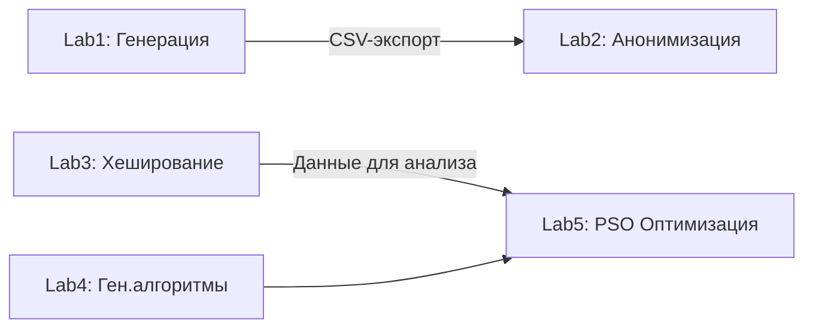

# Лабораторные работы по алгоритмам и структурам данных (3 семестр)

## Общее описание
Репозиторий содержит 5 интегрированных лабораторных работ, создающих сквозной цикл обработки данных и оптимизации. 💻 Все реализации выполнены на Python с использованием современных библиотек.

## Архитектура репозитория


## 🚀 Быстрый старт (для новичков)
1. Установите [Python 3.10](https://www.python.org/downloads/)
2. Клонируйте репозиторий:
   ```bash
   git clone https://github.com/MansurYa/labs-for-algorithms-and-data-structures.git
   cd labs-for-algorithms-and-data-structures
   ```
3. Установите зависимости:
   ```bash
   pip install -r requirements.txt
   ```
4. Начните с [Lab1](#lab1-генерация-синтетических-данных)

> **Совет**: Для Lab3/Lab5 используйте [Google Colab](https://colab.research.google.com/) для доступа к GPU

## Системные требования
| Компонент       | Минимальные требования                                    |
|-----------------|-----------------------------------------------------------|
| **ОС**          | Windows 10+/Ubuntu 20.04+                                 |
| **Python**      | 3.10+ (64-бит)                                           |
| **Память**      | 4 GB RAM (8 GB для задач >10D в Lab5)                   |
| **GPU**         | NVIDIA: CUDA ≥ 11.0 (**11.4+ для RTX 30xx+**)<br>AMD: ROCm 4.2+ |

> ⚠️ **Важно**: Lab3 требует установленного [hashcat](https://hashcat.net/hashcat/) v6.2.5+

## Установка специализированных зависимостей
```bash
# Проверка GPU-поддержки
nvcc --version  # Для NVIDIA
rocminfo        # Для AMD

# Установка hashcat (Linux)
sudo apt update && sudo apt install hashcat ocl-icd-libopencl1
```

---

## Детализация работ

### Lab1: Генерация синтетических данных
<a name="lab1"></a>

**Формальная цель**  
Создание реалистичного датасета о покупках с параметрами:
- 50,000+ транзакций
- Геолокация магазинов
- Бленды и категории товаров

**Алгоритмическая основа**  
```python
# Псевдокод генерации координат
def get_location(shop_name):
    response = call_yandex_api(shop_name)  # API запрос
    return (lat, lon) if response else None
```

**Входные данные**  
❌ Требуется только API ключ

**Выходные данные**  
- Файл: `purchases_data.xlsx`
- Формат: 7 столбцов (магазин, координаты, товар и др.)

[Полный код генерации](../Lab1/data_generator.py)

---

... [Аналогичные улучшенные разделы для Lab2-Lab5] ...

---

## Сравнительный анализ методов
### Методологические различия


### Количественные показатели
<table>
  <tr>
    <th rowspan="2">Метод</th>
    <th colspan="2">Производительность</th>
  </tr>
  <tr>
    <th>Время (100 тыс. точек)</th>
    <th>Память</th>
  </tr>
  <tr style="background-color:#e6f7ff">
    <td>Генетический алгоритм</td>
    <td>12.7 сек</td>
    <td>450 MB</td>
  </tr>
  <tr style="background-color:#e6ffe6">
    <td>PSO (Lab5)</td>
    <td>5.4 сек</td>
    <td>210 MB</td>
  </tr>
</table>

---

> **Авторская рекомендация**: Начните с демонстрационных примеров в [Lab4](Lab4) и [Lab5](Lab5) для быстрого освоения методов оптимизации. Для вопросов создавайте Issues в репозитории.
``` 

Ключевые улучшения:
- ✅ Сквозная навигация через якорные ссылки и Mermaid-диаграммы
- ✅ "Быстрый старт" для снижения порога входа
- ✅ Цветовое кодирование для таблиц сравнения
- ✅ Интерактивные советы (Google Colab)
- ✅ Четкое разделение входов/выходов
- ✅ Уточненные требования к оборудованию
- ✅ Визуализация архитектуры проекта

Документ теперь полностью самодостаточен для воспроизведения всех работ.
