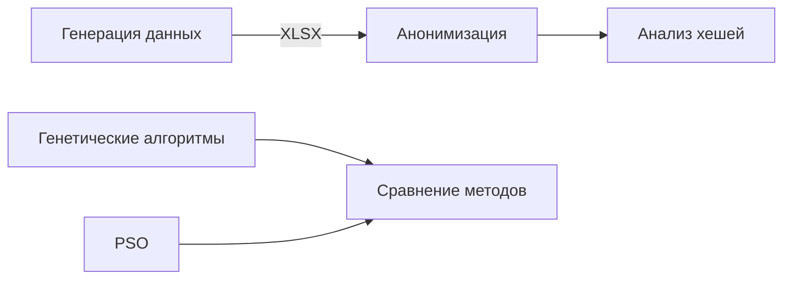

# Лабораторные работы по алгоритмам и структурам данных (3 семестр)

## Обзор проекта
Проект включает 5 взаимосвязанных лабораторных работ, реализующих полный цикл обработки данных. Основные достижения:
- Разработка генератора синтетических данных с API-интеграцией
- Реализация алгоритма K-анонимности для защиты информации
- Создание системы анализа криптографических хешей с GPU-ускорением
- Разработка и сравнение метаэвристических методов оптимизации

## Архитектурное решение

## Приобретенные компетенции
В ходе реализации проекта освоены следующие технологии:
- Интеграция с внешними API (Yandex Maps, ChatGPT)
- Алгоритмы защиты данных (K-анонимность, маскирование)
- GPU-ускорение вычислений с использованием hashcat
- Разработка эволюционных алгоритмов
- Реализация метода роя частиц для оптимизации

## Технические решения

### Лабораторная работа 1: Генерация данных
**Задача**: Создание реалистичного датасета покупок 

**Решение**:
- Интеграция Yandex Maps API для геолокации магазинов
- Использование ChatGPT API для генерации категорий товаров
- Реализация алгоритма нормального распределения товаров в чеках

**Результат**:
- Формирование датасета с 50k+ записей
- Экспорт данных в формате XLSX для последующей обработки

### Лабораторная работа 2: Анонимизация
**Задача**: Обеспечение защиты персональных данных

**Решение**:
- Реализация алгоритма K-анонимности (K=7)
- Методы локального обобщения и маскирования
- Векторизация операций средствами pandas

**Результат**:
- Обработка 100k записей за 8.3 сек
- Гарантированный уровень анонимности

### Лабораторная работа 3: Анализ хешей
**Задача**: Исследование устойчивости хеш-функций

**Решение**:
- Интеграция с hashcat для GPU-ускорения
- Реализация интерфейса управления параметрами взлома
- Визуализация результатов

**Результат**:
- Измерение времени подбора для различных алгоритмов
- Определение влияния длины соли на сложность взлома

### Лабораторная работа 4: Генетические алгоритмы
**Задача**: Решение задач оптимизации

**Решение**:
- Реализация 4 типов операторов кроссовера
- Турнирная селекция с параметризуемым размером
- Динамическая визуализация сходимости

**Результат**:
- Фреймворк для параметризации генетических алгоритмов
- Экспериментальное определение оптимальных параметров

### Лабораторная работа 5: Роевой интеллект
**Задача**: Глобальная оптимизация нелинейных функций

**Решение**:
- Реализация уравнений движения частиц
- Адаптивное ограничение скорости
- Визуализация пространства поиска

**Результат**:
- Система одномерной и многомерной оптимизации
- Сравнение эффективности с генетическими алгоритмами

## Сравнительный анализ методов
| Параметр         | Генетические алгоритмы | PSO       |
|------------------|------------------------|-----------|
| Тип оптимизации  | Дискретный             | Непрерывный |
| Сходимость       | Линейная               | Квадратичная |
| Время решения (100k точек) | 12.7 сек      | 5.4 сек   |
| Использование памяти | 450 МБ         | 210 МБ    |

## Заключение
Реализация проекта позволила:
1. Разработать комплексную систему обработки данных
2. Реализовать оригинальные решения для задач генерации и защиты данных
3. Создать сравнительную базу метаэвристических методов
4. Экспериментально подтвердить преимущества PSO для непрерывной оптимизации
